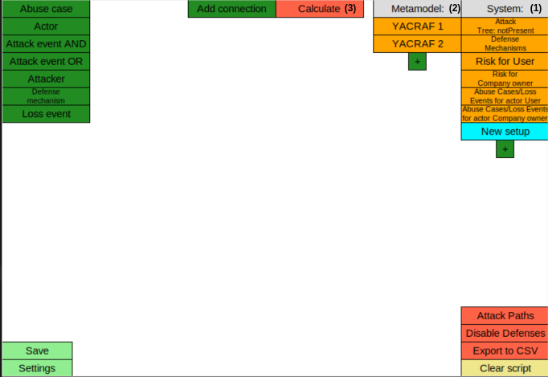
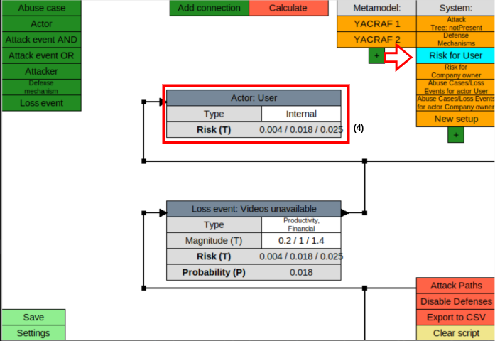

# Pipeline MAL-DSL => YACRAF-calculator

This pipeline connects a threat model established following a MAL-DSL to a risk computaion tool, the YACRAF-calculator.

The input to the pipeline is a YACRAF risk model in a json format. Here, `attack_graph.json` is given as an example. Its components `attack_steps` and `attackers` have been obtained by first instantiating a MAL-DSL with [mal-gui](https://github.com/mal-lang/mal-gui) (i.e. creating a threat model), and then compiling the threat model with the [mal-toolbox](https://github.com/mal-lang/mal-toolbox) into an attack graph. You can read more about this process in [mal-toolbox-tutorial](https://github.com/mal-lang/mal-toolbox-tutorial), and [mal-lang](https://github.com/mal-lang).
Finally, `attack_graph.json` has been manually enriched to contain enough data in order to produce a YACRAF risk model. There is currently to our knowledge no other way of obtaining a risk model in a json format.

The dependencies required to run the pipeline are listed [here](requirements.txt). We recommend installing a virtual environment for the project.

To then run the pipeline, use the command:

`python3 pipeline_main.py attack_graph.json`,

where `attack_graph.json` corresponds to the model you want to compute risk for.

After a few seconds, a window will open-up with your risk model inside of the YACRAF-calculator. You can read about this tool under its own [README](YACRAF-calculator_README.md).

The risk model will be presented in different system views **(1)**. There will be:

- one view per attack tree
- one view to summarize all defenses
- one risk tree per actor
- for each actor, in a separate view, the chain of abuse_case -> attack_event -> loss_event, connecting the attack event that is a root of an attack tree to the abuse cases and loss events in the risk tree.

The metamodel views **(2)** are there to tell the tool how the risk computations are to be made, and should therefore **not** be altered.

You can edit the model in the GUI after its instantiation, or in the json file before. To compute the risk for all actors, simply click the red "Calculate"-button in the GUI **(3)**. 

You can then see the computed risk in each actor-block **(4)**, under their respective views. The risk is given in the form of a [triangular distribution](https://en.wikipedia.org/wiki/Triangular_distribution), where the units are the same as those chosen for the loss events' magnitude.
Note that the calculator performs sampling, and that the risk is therefore non-deterministic.